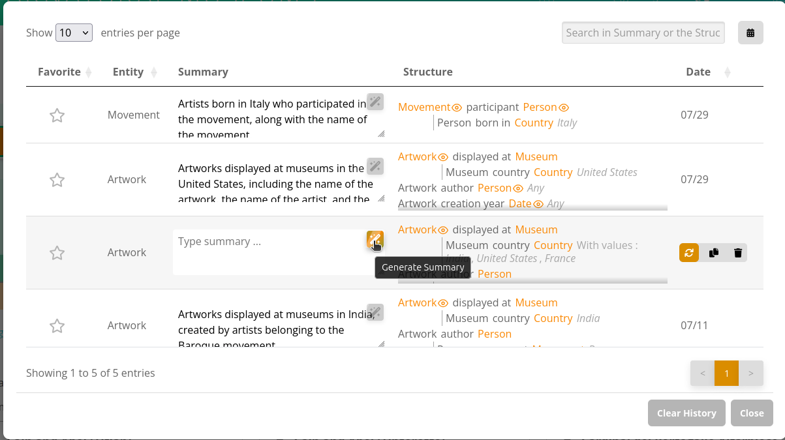

# Sparnatural-history
Sparnatural query history component

## Features Summary

- **Local storage** of stored queries : queries are stored locally in the browser, and persist across sessions
- **Query summary rendering** each query is displayed in a compact way in the history
- **Easy integration** : open the modal dialog from any button or link or icon
- **Favorites support** : Toggle the "star" to put queries in favorite and easily retrieve them
- **Search inside the history** by date range and inside the query structure
- **Sort the history** by date, type searched entity, or by favorites
- **Copy, Load, Delete** actions for each saved query
- **Internationalization** (English/French)

## Screenshots

Automated summary through the integration with [Sparnatural Platform](https://github.com/sparna-git/sparnatural-platform):

## Internal Components

### `SparnaturalHistoryComponent`

The main component rendered inside <sparnatural-history>. Responsible for:

- Rendering the full history interface
- Initializing the selected language

### `HistorySection`

Handles all the UI logic for the modal, including:

- Loading and displaying saved queries
- Applying a custom scrollable summary renderer
- Favoriting (star icons)
- Copying to clipboard
- Deleting entries
- Filtering by date range with a modal
- Graceful fallback for missing `specProvider`

### `DateFilterModal`

A modal window triggered by a calendar icon, allowing users to apply a date range filter (`minDate` / `maxDate`) on saved queries.

### `ConfirmationModal`

A confirmation dialog shown before critical actions, such as deleting a query or clearing all non-favorited history entries.

### `SparnaturalHistoryI18n`

Loads translation labels from language files in `/assets/lang/en-Hist.json` or `/fr-Hist.json`.

### `LocalDataStorage`

Singleton for handling browser `localStorage`:

- `getHistory()` — retrieves saved history
- `saveQuery(queryJson)` — saves a query with date
- `deleteQuery(id)` — deletes a query
- `clearHistory()` — clears all
